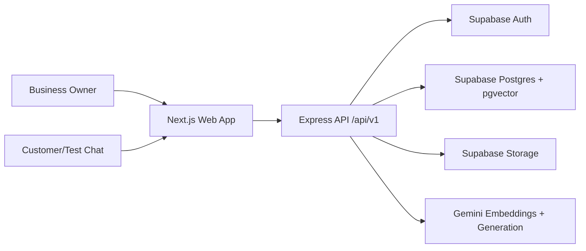

# SupportAI Design

## Architecture

SupportAI uses a modular monorepo with a Next.js web app, Express API, shared TypeScript contracts, Supabase managed services, and Gemini AI.

## Data Flow

Document upload stores the raw file in Supabase Storage, creates a document row, extracts text, chunks content, requests Gemini embeddings, and stores vectors in `document_chunks`. Chat embeds the question, calls `match_document_chunks`, sends retrieved context to Gemini, persists messages, and records analytics.

## Boundaries

- Internal: Next.js UI, Express API, shared contracts, migrations, docs.
- External: Supabase, Gemini, Vercel, Render.
- Tenant boundary: `business_id` on every tenant-owned table plus RLS policies.

## UI

The MVP UI is a compact operational dashboard with authentication, business setup, upload management, FAQ management, chat testing, and analytics. It is mobile responsive and uses restrained colors for repeated business workflows.

## Demo workflow updates

Workspace creation uses a service-role-only Postgres function with a per-account
transaction lock. Business registration metadata is validated before creating the
workspace. Existing membership is reused, preventing repeated setup submissions.

Public profiles and FAQs can be browsed anonymously. Customer chat and history require
a verified Supabase session; conversation ownership is checked in addition to tenant ID.
The owner dashboard includes profile editing, FAQ CRUD, document deletion, analytics,
chat preview and conversation review. FAQs remain accessible on mobile.

RAG combines semantic document retrieval with lexical FAQ selection and the latest
eight messages as conversational context. Only ready documents are retrieved.
Customer/assistant messages are inserted together after successful generation.
Source text is treated as untrusted data. Per-call timeouts prevent indefinite waits.

See DEMO_READINESS.md for verification scope and remaining production boundaries.
